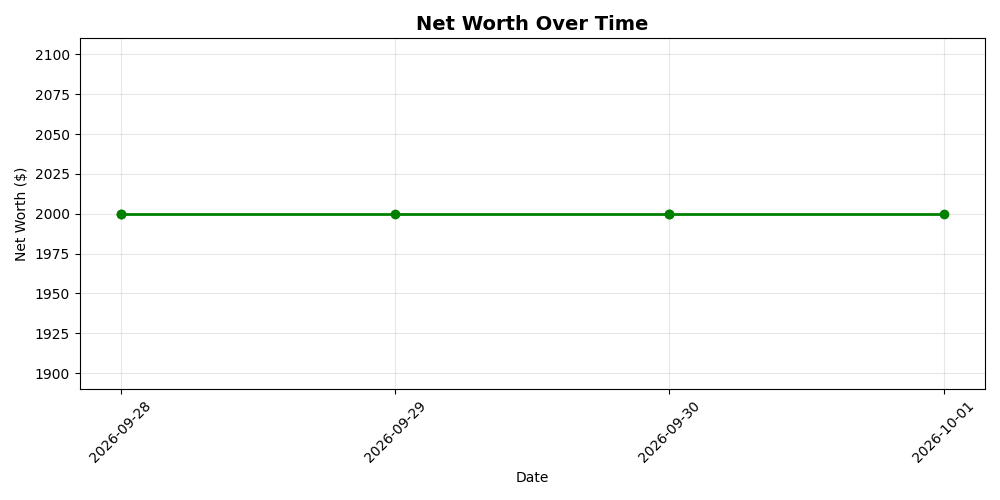

# Wealth Tracker

An AI-powered personal finance tracker that analyzes your financial data and provides brutally honest feedback using Google's Gemini AI.

## What It Does

- Tracks net worth over time (stored in Google Drive)
- Calculates monthly savings, savings rate, and progress toward a goal
- Saves historical data to CSV
- Sends financial data to Gemini AI for a brutally honest assessment
- Displays net worth as a visual chart

## Tech Stack

- **Python 3** — Core language
- **Pandas** — Data analysis
- **Matplotlib** — Visualization
- **Google Gemini API** — AI financial analysis
- **Google Colab** — Development environment

## How to Use

1. Open in Google Colab
2. Mount your Google Drive
3. Add your Gemini API key to Colab Secrets as `GEMINI_API_KEY`
4. Run `wealth_tracker.py` — it will ask for income, expenses, and assets
5. Receive your report plus AI analysis

## Author

Baba Diaper — 26-year-old developer from Guinea, West Africa, building AI skills from scratch in 2026.

## Roadmap

- [x] Basic tracking (income, expenses, net worth)
- [x] Historical data (CSV in Google Drive)
- [x] AI financial analysis (Gemini)
- [x] Visual charts (Matplotlib)
- [ ] Web dashboard (Streamlit)
- [ ] Multi-currency support
- [ ] Automated daily tracking
